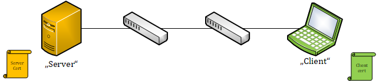

# Qt TLS usage

* [Raw TCP server and client](#raw-tcp-server-and-client)
  + [Server](#server)
  + [Client](#client)
* [Securing the communication](#securing-the-communication)
  + [Finding a solution for 1.](#finding-a-solution-for-1)
  + [Finding a solution for 2.](#finding-a-solution-for-2)
  + [Find a solution for 3. and 4.](#find-a-solution-for-3-and-4)
  + [Putting everything together](#putting-everything-together)
  + [Creating certificates](#creating-certificates)
    - [for the CA](#for-the-ca)
    - [for the server](#for-the-server)
    - [for the first client](#for-the-first-client)
    - [for the other CA's client](#for-the-other-ca-s-client)
  + [Caveats](#caveats)
  + [Putting it all together - SecureEchoService](#putting-it-all-together---secureechoservice)
    - [Secured Server](#secured-server)
    - [Secured Client](#secured-client)
    - [Execution](#execution)
      * [Step 1 - start the server](#step-1---start-the-server)
      * [Step 2 - connect the client w/ verification failing](#step-2---connect-the-client-w--verification-failing)
      * [Step 3 - connect the client w/ verification succeeding](#step-3---connect-the-client-w--verification-succeeding)
      * [Step 4 - connect the client w/ a valid certificate from Other_CA](#step-4---connect-the-client-w--a-valid-certificate-from-other-ca)
  + [More Information on SSL/TLS](#more-information-on-ssl-tls)

## Raw TCP server and client
A raw TCP server and client w/o SSL can be found in [SslUsage/RawEchoService](RawEchoService). The
example uses a command-line parser to configure `interface` and `port` to listen to and can also be
connected using any TCP client, e.g. `netcat`. 

### Server
The server uses the signals
- `&QTcpServer::newConnection()` to acquire the `QTcpSocket*` of an incoming client connection and
- consecutively `&QTcpSocket::readyRead()` on the socket when the TCP stack signals new data is
  available.

Shortened example
```c++
QTcpServer srv;

QObject::connect(&srv, &QTcpServer::newConnection, [&srv]() {
    auto* const client = srv.nextPendingConnection();

    QObject::connect(client, &QTcpSocket::readyRead, [client]() {
        auto const& data = client->readAll();
        client->write(data);
    });
});

srv.listen(QHostAddress::Any, 9876);
```

### Client
The client uses the signals
- `&QTcpSocket::connected()` emitted when the TCP connection to the server was established and
- `&QTcpSocket::readyRead()` as well to read new data received from the server.

Shortened example
```c++
QTcpSocket s;

QObject::connect(&s, &QTcpSocket::connected, [&s]() {
    s.write("hello from client!");
});

QObject::connect(&s, &QTcpSocket::readyRead, [&s]() {
    auto const data = s.readAll();
    // do something with "data"
});

s.connectToHost("localhost", 9876);
```

## Securing the communication
The previous example has several problems with security:

1. data is transported unencrypted as _plain text_, hence everybody on the machines and on the route
   between client and server could read the data
2. data could easily be altered on the route, without any partner knowing
3. client does not know if it speaks to the correct "server" or a man-in-the-middle attacker
4. server does not know if the actual client speaks to it or not

The standard for solving this problem is
[**TLS** (_Transport Layer Security_)](https://en.wikipedia.org/wiki/Transport_Layer_Security).

We will concentrate on the latest version (as of 2020-07) TLS v1.3 here.

### Finding a solution for 1.
Obviously, the solution for 1. is to use TLS, as this will introduce symmetric encryption between
the communication peers. Anyway, all peers must somehow agree on a common secret when performing the
_Client Hello_, simplest solution would be the so-called _pre-shared key_ **PSK**.


The problems with this solution are
- you need to securely roll-out the PSK to all clients
- you need to securely store the PSK on the client
- you only have **one** PSK for the whole set-up, so every client will use the same PSK
- if it is compromised for one client (e.g. laptop stolen, phishing attack), it is compromised for
  all and the roll-out needs to start over again

Overall, this is not a feasible solution, as it also does not solve
- identification of server and client

Nevertheless, Qt supports `QSslPreSharedKeyAuthenticator` for this

```c++
QSslSocket s;
connect(s, &QSslSocket::preSharedKeyAuthenticationRequired, this, [](QSslPreSharedKeyAuthenticator* authenticator) {
    authenticator->setIdentity("client");

    // get thePSK from somewhere, e.g. derive it from authenticator->identityHint()...

    authenticator->setPreSharedKey(thePSK);
});
```

But, because of the disadvantages already mentioned above, we SHALL rely on a key exchange that
works asymmetric and over an open network. We advocate for
[Diffie-Hellman](https://en.wikipedia.org/wiki/Diffie%E2%80%93Hellman_key_exchange) here.

### Finding a solution for 2.
TLS brings **DSA** (_Digital Signature Algorithm_) for that. We'll see this in the sample below.

### Find a solution for 3. and 4.
We need to find a way that the server and client can identify themselves. This is done using
so-called **certificates**. Follow-up with
[Wikipedia](https://en.wikipedia.org/wiki/Public_key_certificate) for more details.



So, basically the server presents its (orange) certificate to the client while handshaking, the
client presents its (green) certificate to the server.

Both can have a fixed list of certificates they accept and hence we solved the problem of knowing
who we talk to. But: this would again not scale if would need to

Hence, client and server need to agree on a shared authority that both trust, a so-called
_Certificate Authority_ **CA**. This CA digitally signs those certificates and hence both, client
and server, only need to check if a certificate presented is valid. Certificates can easily be added
(new clients) or revoked (upon compromise).


### Putting everything together
In order to make this work with Qt we need to

1. become a _Certificate Authority_ and
   1. create a CA certificate
   2. create a server certificate and sign it with the CA
   3. create a client certificate and sign it with the CA
   4. create another CA certificate to test the bad case (presented certificates not signed by this
      CA certificate)
2. use `QSslSocket` on top of `QTcpServer` in the server, `QSslSocket` in the client
3. setup the connection and implement all checks as stated above

### Creating certificates
We will use the **OpenSSL** binary to create them (`1.1.1g` is latest as of writing), e.g.
[from here](https://bintray.com/vszakats/generic/openssl):

```shell
> openssl version

OpenSSL 1.1.1g  21 Apr 2020
```

#### for the CA
- create the **CA's private key** (in the example I'm using `CA_password` as pass phrase)
```
>openssl genrsa -aes256 -out CA.key 4096

Generating RSA private key, 4096 bit long modulus (2 primes)
.......................++++
................++++
e is 65537 (0x010001)
Enter pass phrase for CA.key:
Verifying - Enter pass phrase for CA.key:
```

- create the **CA certificate**

```
>openssl req -x509 -new -nodes -key CA.key -sha256 -days 365 -out CA.pem

Enter pass phrase for CA.key:
You are about to be asked to enter information that will be incorporated
into your certificate request.
What you are about to enter is what is called a Distinguished Name or a DN.
There are quite a few fields but you can leave some blank
For some fields there will be a default value,
If you enter '.', the field will be left blank.
-----
Country Name (2 letter code) [AU]:DE
State or Province Name (full name) [Some-State]:Berlin
Locality Name (eg, city) []:Berlin
Organization Name (eg, company) [Internet Widgits Pty Ltd]:github.com/ssproessig
Organizational Unit Name (eg, section) []:
Common Name (e.g. server FQDN or YOUR name) []:CA
Email Address []:ssproessig@gmail.com
```

- repeat those steps to create `Other_CA.key` and `Other_CA.pem`

#### for the server
-  create a private key for the server (using `server` as pass phrase this time)
```
>openssl genrsa -aes256 -out server.key 4096

Generating RSA private key, 4096 bit long modulus (2 primes)
............................................................................++++...++++
e is 65537 (0x010001)
Enter pass phrase for server.key:
Verifying - Enter pass phrase for server.key:
```

- create a _certificate request_ for the server
```
>openssl req -key server.key -new -out server.req

Enter pass phrase for server.key:
You are about to be asked to enter information that will be incorporated
into your certificate request.
What you are about to enter is what is called a Distinguished Name or a DN.
There are quite a few fields but you can leave some blank
For some fields there will be a default value,
If you enter '.', the field will be left blank.
-----
Country Name (2 letter code) [AU]:DE
State or Province Name (full name) [Some-State]:Berlin
Locality Name (eg, city) []:Berlin
Organization Name (eg, company) [Internet Widgits Pty Ltd]:github.com/ssproessig
Organizational Unit Name (eg, section) []:
Common Name (e.g. server FQDN or YOUR name) []:server
Email Address []:

Please enter the following 'extra' attributes
to be sent with your certificate request
A challenge password []:
An optional company name []:
```

- use the CA to create a signed certificate for the server's certificate request
```
> openssl x509 -req -in server.req -CA CA.pem -CAkey CA.key -CAserial CA_serial -CAcreateserial -out server.pem

Signature ok subject=C = DE, ST = Berlin, L = Berlin, O = github.com/ssproessig, CN = > server Getting CA Private Key Enter pass phrase for CA.key:

```

- have a look at the certificate
```
>openssl x509 -in server.pem -text -noout
Certificate:
    Data:
        Version: 1 (0x0)
        Serial Number:
            5c:57:ab:ab:07:39:b2:23:37:f7:55:36:a8:9c:2c:50:0a:7a:67:4c
        Signature Algorithm: sha256WithRSAEncryption
        Issuer: C = DE, ST = Berlin, L = Berlin, O = github.com/ssproessig, CN = CA, emailAddress = ssproessig@gmail.com
        Validity
            Not Before: Jul  1 19:20:05 2020 GMT
            Not After : Jul 31 19:20:05 2020 GMT
        Subject: C = DE, ST = Berlin, L = Berlin, O = github.com/ssproessig, CN = server, emailAddress = ssproessig@gmail.com
        Subject Public Key Info:
            Public Key Algorithm: rsaEncryption
                RSA Public-Key: (4096 bit)
                Modulus:
....
                Exponent: 65537 (0x10001)
    Signature Algorithm: sha256WithRSAEncryption
 ...
```

#### for the first client
- repeat the server steps as above, but
  - use `client_01.key` as file name of the private key, use `client_01` as passphrase
  - use `client_01.req` as file name for certificate request, `client_01` as CN
  - use `client_01.pem` as certificate name - and omit `-CAcreateserial`, as the serial file already
    exists

#### for the other CA's client
- repeat the server steps as above, but
  - use `Other_client_01.key` as file name of the private key, use `client_01` as passphrase
  - use `Other_client_01.req` as file name for certificate request, `client_01` as CN
  - use `Other_client_01.pem` as certificate name - and omit `-CAcreateserial`, as the serial file
    already exists, and use the `Other_CA` to sign

### Caveats
- `openssl` may try to use a non-existent `openssl.conf` and fail - use environment variable
  `OPENSSL_CONF` to point to the correct one ... and think about to things like _Country Name_,
  _Locality Name_ etc. there directly to avoid typing it over and over again
- Qt probably uses `openssl` as SSL/TLS plugin library - hence the applications will compile and
  run, but SSL will not work, unless `libcrypto-1_1-x64.dll` and `libssl-1_1-x64.dll` are on the
  `PATH`. (Hint: if the applications fail to load the `key` and `cert` at startup, this is probably
  what's happening.)

### Putting it all together - SecureEchoService
#### Secured Server
The server uses the same code as the raw echo server, only replacing `QTcpServer` with
`SecureServer`. `SecureServer` is a `QTcpServer` realization, that overwrites `void
incomingConnection(qintptr const aSocketDescriptor)` and adds the SSL/TLS code there:

```cpp
void incomingConnection(qintptr const aSocketDescriptor) override
{
    auto* sslSocket = new QSslSocket(this);

    if (sslSocket->setSocketDescriptor(aSocketDescriptor))
    {
        connect(sslSocket, QOverload<SslErrs>::of(&QSslSocket::sslErrors), [&](SslErrs errors) {
            dumpSslErrors(errors, *sslSocket);
        });
        addPendingConnection(sslSocket);

        setupSslConfigurationFor(*sslSocket, key, cert);

        sslSocket->startServerEncryption();
    }
    else
    {
        sslSocket->deleteLater();
    }
}
```

with `setupSslConfigurationFor(<socket>, <this_peer_key>, <this_peer_cert>)` defined as

```c++
void setupSslConfigurationFor(QSslSocket& s, QSslKey const& key, QSslCertificate const& cert)
{
    // alter the sockets existing configuration
    auto sslConfig = s.sslConfiguration();
    {
        // enforce TLS v1.3
        sslConfig.setProtocol(QSsl::TlsV1_3);

        // don't use a CA chain - only our own Certificate Authority is allowed
        sslConfig.setCaCertificates({QSslCertificate(readFromQrc(":/CA"), QSsl::Pem)});

        // load the passed certificate with the given key
        sslConfig.setPrivateKey(key);
        sslConfig.setLocalCertificate(cert);

        // verify the connection peer's certificate - fail connection if it fails
        // note: QSslSocket::QueryPeer will only warn if the peer verification failed - discouraged
        sslConfig.setPeerVerifyMode(QSslSocket::VerifyPeer);
    }
    s.setSslConfiguration(sslConfig);
}
```

**Note:** for demonstration purposes we want to easily load certificates and keys. For that they are
compiled into the applications using _Qt's resource system_. Refer to
[ClientCredentials.qrc](SecureEchoService/ClientCredentials.qrc) and
[ServerCredentials.qrc](SecureEchoService/ServerCredentials.qrc) to see where resource files `:/CA`
and `:/Certificate` etc. resolve to.

#### Secured Client
The client basically uses the same logic as the raw echo client, but
1. replaces `QTcpSocket` with `QSslSocket`
2. configures the socket with `setupSslConfigurationFor(...)` as well
3. uses `connectToHostEncrypted(...)` instead of `connectToHost(...)` and waits for the encrypted
   connection to be established

#### Execution
##### Step 1 - start the server
first we start the server into its own window
```
>start SslUsage\SecureEchoService\Debug\SslUsage.SecureServer.exe

...
20200701_215310.172  D  loadKey:28  error loading key? false
20200701_215310.176  I  loadKey:29  Loaded key:  QSslKey(PrivateKey, RSA, 4096)
20200701_215310.179  D  loadCert:38  error loading cert? false
20200701_215310.182  I  loadCert:39  Loaded certificate:  QSslCertificate("1", "5c:57:ab:ab:07:39:b2:23:37:f7:55:36:a8:9c:2c:50:0a:7a:67:4c", "Ve7Pt6ETDb4w2QBhDhG1ug==", "CA", "server", QMap(), QDateTime(2020-07-01 19:20:05.000 UTC Qt::UTC), QDateTime(2020-07-31 19:20:05.000 UTC Qt::UTC))
20200701_215310.201  D  main:106  secure echo server listening on QHostAddress("127.0.0.1") : 9876 !
```
ensure

- the server is listening
- neither `key` not `cert` had an error loading

##### Step 2 - connect the client w/ verification failing
```
>SslUsage\SecureEchoService\Debug\SslUsage.SecureClient.exe

20200701_215441.668  D  loadCert:38  error loading cert? false
20200701_215441.672  I  loadCert:39  Loaded certificate:  QSslCertificate("1", "5c:57:ab:ab:07:39:b2:23:37:f7:55:36:a8:9c:2c:50:0a:7a:67:4e", "iRwlqgrODXY4RHdM2my3NA==", "CA", "client_01", QMap(), QDateTime(2020-07-01 19:26:41.000 UTC Qt::UTC), QDateTime(2020-07-31 19:26:41.000 UTC Qt::UTC))
20200701_215441.684  D  loadKey:28  error loading key? false
20200701_215441.692  I  loadKey:29  Loaded key:  QSslKey(PrivateKey, RSA, 4096)
20200701_215441.699  I  main:58  connecting to "127.0.0.1" : 9876 ...
20200701_215441.728  D  dumpSslErrors:86  SSL errors:
20200701_215441.731  C  dumpSslErrors:89  "The host name did not match any of the valid hosts for this certificate"
20200701_215441.736  D  dumpSslErrors:92  peer certificate chain:
20200701_215441.741  D  dumpCert:70  ---
20200701_215441.743  D  dumpCert:71  digest:  "55eecfb7a1130dbe30d900610e11b5ba"
20200701_215441.747  D  dumpCert:72  serial:  "35633a35373a61623a61623a30373a33393a62323a32333a33373a66373a35353a33363a61383a39633a32633a35303a30613a37613a36373a3463"
20200701_215441.756  D  dumpCert:73  ---subject
20200701_215441.769  D  dumpCert:74  CN:  "server"
20200701_215441.774  D  dumpCert:75  ORG: "github.com/ssproessig"
20200701_215441.779  D  dumpCert:76  ---issuer
20200701_215441.782  D  dumpCert:77  CN:  ("CA")
20200701_215441.784  D  dumpCert:78  ORG: ("github.com/ssproessig")
20200701_215441.787  D  dumpCert:79
20200701_215441.793  D  dumpCert:70  ---
20200701_215441.795  D  dumpCert:71  digest:  "29d034ad4cdee1a73f69c90fbfc81719"
20200701_215441.799  D  dumpCert:72  serial:  "32643a35343a64613a61353a61643a61613a61623a63653a62353a32333a64313a61333a30373a66363a64313a39633a30313a35313a66663a3262"
20200701_215441.807  D  dumpCert:73  ---subject
20200701_215441.809  D  dumpCert:74  CN:  "CA"
20200701_215441.812  D  dumpCert:75  ORG: "github.com/ssproessig"
20200701_215441.817  D  dumpCert:76  ---issuer
20200701_215441.819  D  dumpCert:77  CN:  ("CA")
20200701_215441.829  D  dumpCert:78  ORG: ("github.com/ssproessig")
20200701_215441.832  D  dumpCert:79
20200701_215441.834  C  main:68  unable to connect securely
```

ensure neither `key` not `cert` had an error loading and note
- handshake failed with `The host name did not match any of the valid hosts for this certificate`
- the certificate chain is dumped, first the `server` certificated, then our `CA`

Why did it fail? The server's log will not help us
```
20200701_215737.894  D  main::::operator():78  new client connected from "127.0.0.1" : 53010
20200701_215738.013  D  main::::()::::operator():91  client from "127.0.0.1" : 53010 disconnected
```
obviously the client terminated the connection. This happens, because by default we connect to
`127.0.0.1` (where our server is listening by default). But this is not the server's certificate
_Common Name_, it says `server`.

##### Step 3 - connect the client w/ verification succeeding
Hence we need to make sure to either have the server's IP address as _Common Name_ (discouraged) or
resolve `server` to where our server is currently running. Adding `127.0.0.1 server` to
`C:\Windows\System32\drivers\etc\hosts` solves this for a test.

Afterwards executing the client again leads to
```
>SslUsage\SecureEchoService\Debug\SslUsage.SecureClient.exe --host server
20200701_220121.338  D  loadCert:38  error loading cert? false
20200701_220121.341  I  loadCert:39  Loaded certificate:  QSslCertificate("1", "5c:57:ab:ab:07:39:b2:23:37:f7:55:36:a8:9c:2c:50:0a:7a:67:4e", "iRwlqgrODXY4RHdM2my3NA==", "CA", "client_01", QMap(), QDateTime(2020-07-01 19:26:41.000 UTC Qt::UTC), QDateTime(2020-07-31 19:26:41.000 UTC Qt::UTC))
20200701_220121.355  D  loadKey:28  error loading key? false
20200701_220121.360  I  loadKey:29  Loaded key:  QSslKey(PrivateKey, RSA, 4096)
20200701_220121.366  I  main:58  connecting to "server" : 9876 ...
20200701_220121.400  I  main:62  we have secure communication
20200701_220121.402  D  main:63  session cipher QSslCipher(name=TLS_AES_256_GCM_SHA384, bits=256, proto=TLSv1.3)
20200701_220121.414  D  main::::operator():54  received:  "Welcome to SecureEchoServer!\nhello from secure client!"
```
and in the server
```
20200701_220121.382  D  main::::operator():78  new client connected from "127.0.0.1" : 53042
20200701_220121.409  D  main::::()::::operator():85  echoing back:  "hello from secure client!"
20200701_220121.418  D  main::::()::::operator():91  client from "127.0.0.1" : 53042 disconnected
```

So, now our client verified that it was talking to the correct server - done.

Watching the exchange with Wireshark we can see the overall TLS v1.3 exchange


##### Step 4 - connect the client w/ a valid certificate from Other_CA
Finally we test using a valid certificate that was signed by `Other_CA`, which is not "our" CA that
server and client share:

```
>SslUsage\SecureEchoService\Debug\SslUsage.SecureClient.exe --host server --cert ":/Other_Certificate" --key ":/Other_Key"
20200701_222834.313  D  loadCert:39  error loading cert? false
20200701_222834.318  I  loadCert:40  Loaded certificate:  QSslCertificate("1", "1c:2f:35:6c:f0:d9:69:ff:a7:86:90:e2:06:0f:0b:99:c1:d2:3f:01", "FNEz+n2H8csFypB8UT49hw==", "Other_CA", "client_01", QMap(), QDateTime(2020-07-01 20:13:17.000 UTC Qt::UTC), QDateTime(2020-07-31 20:13:17.000 UTC Qt::UTC))
20200701_222834.328  D  loadKey:29  error loading key? false
20200701_222834.331  I  loadKey:30  Loaded key:  QSslKey(PrivateKey, RSA, 4096)
20200701_222834.333  I  main:58  connecting to "server" : 9876 ...
20200701_222839.343  C  main:69  unable to connect securely
```

### More Information on SSL/TLS
- read the [excellent TLS v1.3 slides by Andy Brodie from the OWASP London 2018 summit][slides]

[slides]: https://owasp.org/www-chapter-london/assets/slides/OWASPLondon20180125_TLSv1.3_Andy_Brodie.pdf
