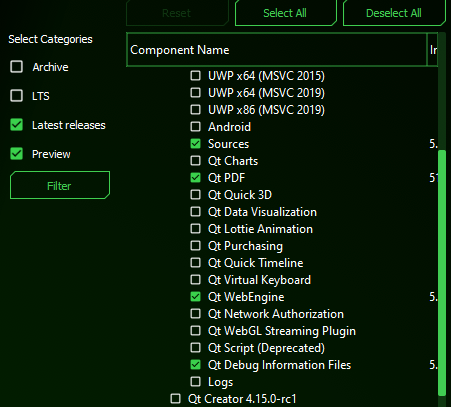

# WebEnginePdf README

The basic idea: use Chromium as PDF report generator, don't implement your own page break and
layouting algorithm. Use a one-page HTML source for that, that is styled with CSS and uses inline
data URLs for images.

## Requirements
The following optional components must be installed

- Qt PDF
- Qt WebEngine



## Doing
- make your CMake find `Qt::WebEngine Qt::WebEngineWidgets Qt::Pdf Qt::PdfWidgets`
- create your `.ui` - manually add `QWidget`s and propagate them to `QWebEngineView` or `QPdfView`
- have a text edit with the HTML source code
- on click make the `QWebEngineView` load the HTML
```c++
    connect(ui->btnToBrowser, &QPushButton::clicked, [=]() {
        ui->webView->setHtml(ui->edHtmlSource->toPlainText());

        ui->tabWidget->setCurrentWidget(ui->tabWebWidget);
    });
```
- on click make the `QWebEngine` print to PDF file
```c++
    connect(ui->btnSavePDF, &QPushButton::clicked, [=]() {
        if (auto* const page = ui->webView->page(); page)
        {
            QPageLayout const& layout = {
                    QPageSize(QPageSize::A5), QPageLayout::Portrait, QMarginsF(10, 10, 10, 10)};
            page->printToPdf(d->filename, layout);
        }
    });
```
- on click make the `QPdfView` load this PDF file
```c++
    connect(ui->btnLoadPDF, &QPushButton::clicked, [=]() {
        d->document->load(d->filename);
        ui->pdfView->setDocument(d->document);

        ui->pdfView->setPageMode(QPdfView::SinglePage);
        ui->pdfView->pageNavigation()->setCurrentPage(0);
        ui->pdfView->setZoomMode(QPdfView::FitInView);
        d->updatePageLabel();

        ui->tabWidget->setCurrentWidget(ui->tabPdfWidget);
    });
```
- some PDF GUI stuff (like zoom to fit, show page of pages on label)
```c++
    connect(ui->btnNext, &QPushButton::clicked, [=]() {
        ui->pdfView->pageNavigation()->goToNextPage();
    });

    connect(ui->btnPrev, &QPushButton::clicked, [=]() {
        ui->pdfView->pageNavigation()->goToPreviousPage();
    });

    connect(ui->pdfView->pageNavigation(), &QPdfPageNavigation::currentPageChanged, [=]() {
        d->updatePageLabel();
    });
    
    // ... with ...

struct WebEnginePdf::Data
{
    void updatePageLabel()
    {
        auto* const nav = ui.pdfView->pageNavigation();
        ui.lbPages->setText(
                QString("Page %1 / %2").arg(nav->currentPage() + 1).arg(nav->pageCount()));
    }
};
```

## ToDo
- experiment with CSS media queries
- add SVG images
- experiment with page headers and footers to every page (like _"page 1 of 3"_ in the footer)
